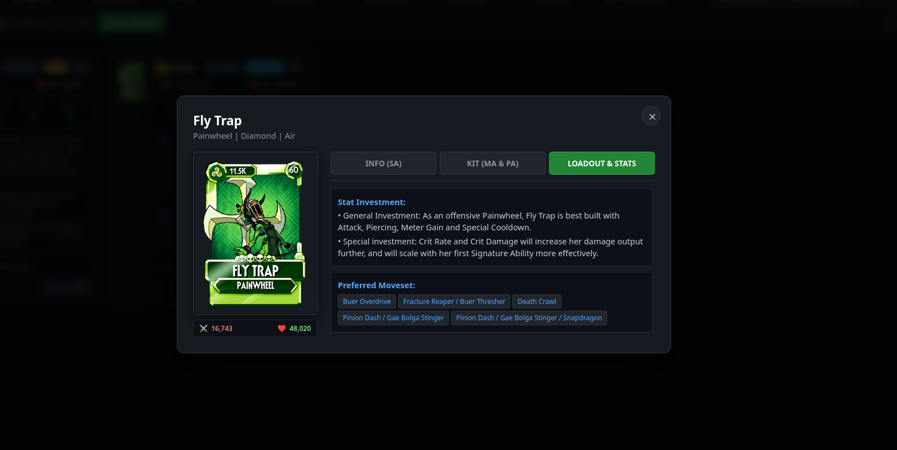
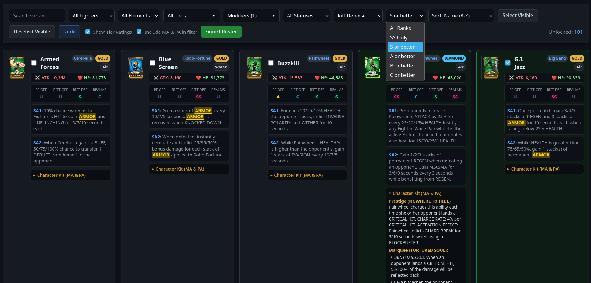
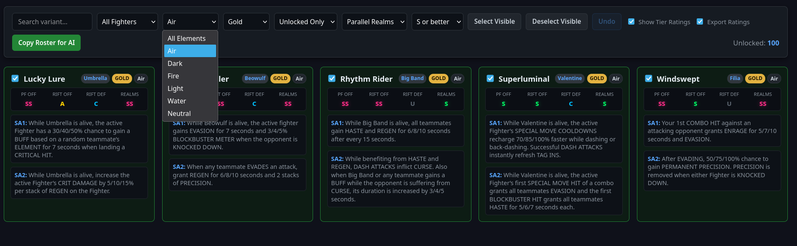
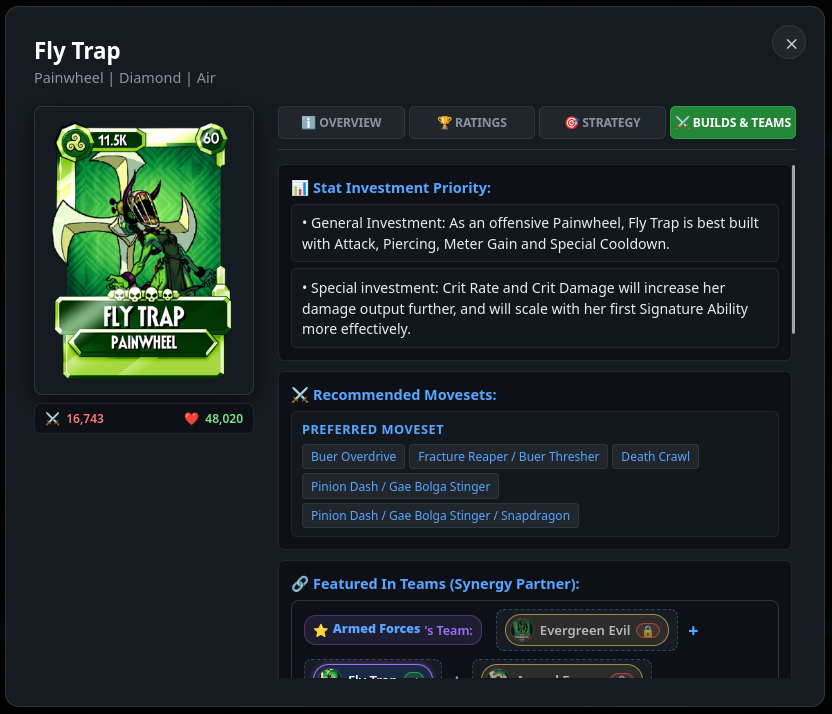
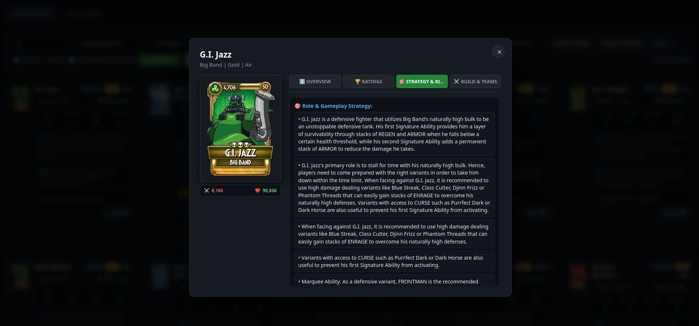
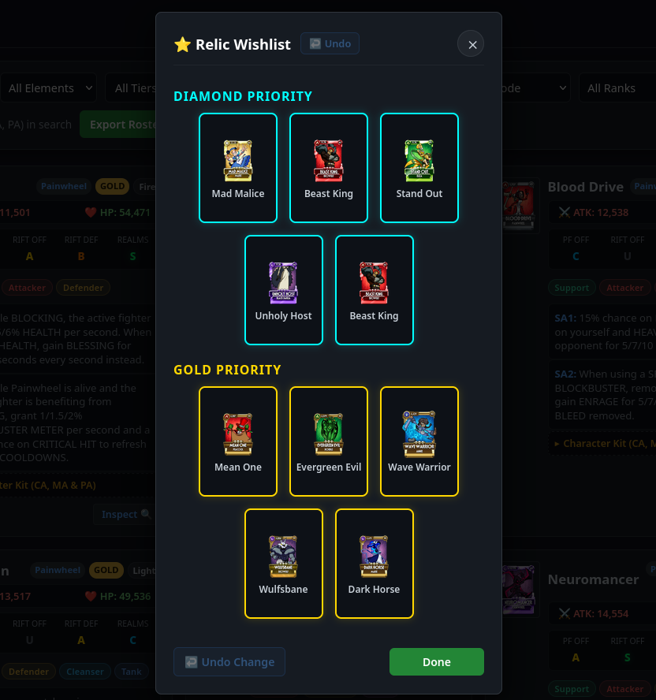
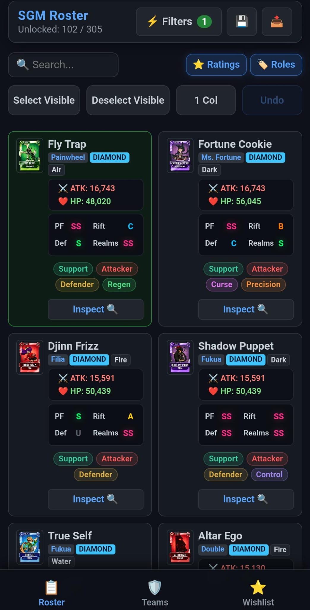

# Skullgirls Mobile - SGM Roster Tracker & Team Builder (v2.5.0 - Smart Random Team Generator Update)

An advanced offline-first web application and Progressive Web App (PWA) designed for Skullgirls Mobile players to track their variant collection, build custom teams with live synergy analysis, manage wishlists, inspect fighter kits and Fandom Wiki loadouts, filter by combat modifiers, and export custom rosters.



---

## Live Demo & Mobile PWA Installation

**Open Web App in Browser:**  
[https://mattex111.github.io/sgm-roster-tracker/](https://mattex111.github.io/sgm-roster-tracker/)

### Installing to Home Screen (iOS & Android)
- **Android (Chrome / Brave / Firefox):** Open the link -> Tap **⋮** (top right) -> Select **Add to Home screen**.
- **iOS (Safari):** Open the link -> Tap **Share** (square with up arrow) -> Select **Add to Home Screen**.

---

## What's New in v2.5.0

- **Smart Random Team Generator (`🎲 Random Team`):** Instantly generate fun, dynamic, and tailored 3-fighter squad compositions directly from the Team Builder view with customizable rules.
- **Smart Randomization Rules:** Choose between **Pure Chaos** (100% random), **Mono-Element** (same elemental affinity), **Mono-Character** (same character base), and **Top Tier Only** (SS / S / A ranked meta variants).
- **Pool Selection:** Toggle between sampling **Only Owned Roster** (unlocked collection) vs **Full Database** (all 305+ variants).
- **Per-Slot Reroll (`Reroll`):** Lock two fighters in a squad and reroll single individual slots in both the Random Generator Modal and the main Team Builder editor.
- **Dynamic Contextual Naming Engine:** Infinite, thematic squad titles generated dynamically based on element types, character bases, and meta tiers (e.g., *"Infernal Vanguards"*, *"Filia Trinity"*, *"Apex Predators #42"*).
- **In-Editor Auto-Fill (`Auto-Fill Squad`):** Fill empty slots in existing draft teams with one tap while preserving already selected fighters.
- **Instant Synergy & Ability Preview:** Previews combined Signature Abilities (SA1 & SA2) and support synergies in real time for generated teams.

---

## Features

- **Interactive Roster Checklist:** Tap anywhere on a fighter card to mark it as owned with local storage persistence (`localStorage` in PWA & `my_roster.json` on local Python server). If you previously used the local PC desktop version, you can import your existing JSON files (`my_roster.json`, `my_teams.json`, `my_wishlist.json`) directly into the web app.
- **Team Builder & Synergy Analyzer:** Create, save, and manage custom 3-fighter loadouts tailored for specific game modes (*Prize Fight*, *Rift Offense*, *Rift Defense*, *Parallel Realms*). Previews combined Signature Abilities (SA1 & SA2) and support synergies.
- **Wishlist Tracker:** Track target Gold and Diamond variants with interactive priority slots.
- **Base Stats (Max Lvl 60):** Official Max ATK and HP stats for all 305+ variants.
- **Full Character Kit:** Expandable details showing Character Ability (CA), Prestige Abilities (PA), and Marquee options (MA).
- **Wiki Loadouts:** Integrated Stat Investments, Role & Strategy, Rift notes, and Multi-Setup Movesets scraped directly from the Skullgirls Mobile Fandom Wiki.
- **Global Text & Modifier Multi-Search:** Filter fighters by specific Buffs and Debuffs (e.g. *Hex*, *Curse*, *Armor*, *Thorns*) with keyword highlighting.
- **Meta Tier Ratings:** Community tier ratings across 4 modes (PF Offense, Rift Offense, Rift Defense, Parallel Realms) sourced from the [Fandom Community Tier List](https://skullgirlsmobile.fandom.com/wiki/Tier_List).
- **Custom Clipboard Exporter:** Export selections in Full markdown, single-line Compact summaries, or comma-separated name lists.
- **Accident Prevention:** Bulk selection safeguards with one-click Undo (`Ctrl+Z`).
- **100% Offline & Private:** No accounts, external servers, or tracking cookies.

---

## Screenshots

      

---

## Local Setup & Run (Desktop Development)

### Prerequisites
1. **Python (3.8 or higher):** Download from [python.org](https://www.python.org/downloads/).
   - *Windows Users:* Check the box **"Add python.exe to PATH"** during installation.
2. **Git:** Download from [git-scm.com](https://git-scm.com/downloads).

### Installation

```bash
git clone https://github.com/Mattex111/sgm-roster-tracker.git
cd sgm-roster-tracker
python3 -m venv venv
source venv/bin/activate  # On Windows: venv\Scripts\activate
pip install -r requirements.txt
python3 app.py
```
Open `http://localhost:5000` in your browser.

### Running the App Again (Subsequent Uses)

Once initial setup is complete, you do not need to create `venv` or run `pip install` again. Open terminal in the project folder and run:

- **Windows:**
  ```cmd
  venv\Scripts\activate
  python app.py
  ```
- **Linux / macOS:**
  ```bash
  source venv/bin/activate
  python3 app.py
  ```

---

## Frequently Asked Questions (FAQ)

### How do I update to the latest version? Will I lose my saved roster or teams?
- **PWA / Web App:** Updates are deployed automatically to GitHub Pages. Whenever you refresh or re-open the app online, you receive the latest version.
- **Local Python Setup:** Run `git pull` in your terminal.
- **Data Safety:** Your collection, wishlist, and custom teams are saved in browser storage (`localStorage`) or local files (`my_roster.json`, `my_teams.json`). Updating the code will **never** overwrite or erase your progress.

### How do I transfer or import my saved roster and teams between PC and phone?
Use the **Backup & Restore** feature in the top navigation bar:
1. **Importing PC Desktop / Legacy Data:** Click **Select JSON File(s) to Import**. You can select your old JSON files from the PC desktop version (`my_roster.json`, `my_teams.json`, `my_wishlist.json`) or a combined backup file (`sgm_tracker_backup.json`). You can select multiple files at once.
2. **Exporting Backup:** Click **Download Data Backup (.JSON)** to save a single combined backup file to transfer between devices.

### Does the app require Python or an internet connection on mobile?
No. The application is built as an offline-first Progressive Web App (PWA). Once installed on your smartphone's home screen or cached in your browser, it runs standalone without needing a Python backend or active internet connection.

### Why do I need to activate `venv` when running locally with Python?
`python -m venv venv` creates an isolated environment so dependencies (like Flask) do not conflict with system Python packages. Activating `venv` ensures your terminal loads those isolated packages before executing `python app.py`.

### Where does the data (stats, movesets, tier ratings) come from?
Fighter stats, Signature Abilities, Prestige, Marquee abilities, and recommended loadouts are scraped from the [Skullgirls Mobile Fandom Wiki](https://skullgirlsmobile.fandom.com/). Tier list rankings are sourced directly from the [Fandom Community Tier List](https://skullgirlsmobile.fandom.com/wiki/Tier_List).

---

## License

Distributed under the MIT License. See `LICENSE` for details.

