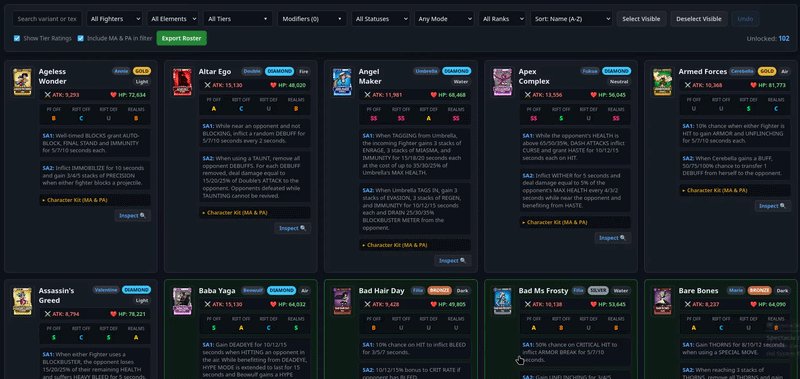

# Skullgirls Mobile - Roster Tracker

An advanced offline web tool designed for Skullgirls Mobile players to track their collection, build custom teams with synergy analysis, manage wishlists, inspect fighter kits and official Fandom Wiki loadouts, filter by combat modifiers, and export custom rosters.



## Features

- **Interactive Roster Checklist:** Click anywhere on a fighter card to mark it as owned in real time with persistent local storage (`my_roster.json`).
- **Team Builder & Synergy Analyzer:** Create, save, and manage custom 3-fighter loadouts tailored for specific game modes (*Prize Fight*, *Rift Offense*, *Rift Defense*, *Parallel Realms*). Automatically previews combined Signature Abilities (SA1 & SA2) and support synergies, with duplicate protection and tier rank sorting.
- **Wishlist Tracker:** Track target Gold and Diamond variants you are hunting for with interactive priority slots.
- **Base Stats (Max Lvl 60):** Card view displays official Max ATK and HP stats.
- **Full Character Kit:** Expandable details showing character-specific Prestige Abilities (PA) and Marquee options (MA).
- **Official Wiki Loadouts:** Integrated Stat Investments and Preferred Movesets scraped directly from the official Skullgirls Mobile Fandom Wiki.
- **Global Text Search & Highlight:** Search freely across variant names, descriptions, and kits with real-time keyword highlighting.
- **Modifier Multi-Search:** Filter fighters by specific Buffs and Debuffs (e.g. *Hex*, *Curse*, *Armor*, *Thorns*) with keyword highlighting.
- **Tier Multi-Select:** Choose single or combined rarity pools (*Diamond*, *Gold*, *Silver*, *Bronze*).
- **Meta Grades:** Community tier ratings across 4 modes (PF Offense, Rift Offense, Rift Defense, Parallel Realms) sourced from the [Fandom Community Tier List](https://skullgirlsmobile.fandom.com/wiki/Tier_List).
- **Custom Clipboard Exporter:** Export selections in Full markdown, single-line Compact summaries, or comma-separated name lists.
- **Accident Prevention:** Bulk selection safeguards with one-click Undo (`Ctrl+Z`).
- **100% Offline & Private:** No accounts, external servers, or tracking cookies.

## Screenshots

  

## Setup & Run

### For Windows Users

1. **Clone the repository & enter the folder:**
   ```cmd
   git clone https://github.com/Mattex111/sgm-roster-tracker.git
   cd sgm-roster-tracker
   ```
2. **Create and activate the virtual environment:**
    ```cmd
    python -m venv venv
    venv\Scripts\activate
    ```
3. **Install dependencies:**
    ```cmd
    pip install -r requirements.txt
    ```
4. **Start the application:**
    ```cmd
    python app.py
    ```
    Open http://localhost:5000 in your browser.

### For Linux / macOS Users

1. **Clone the repository & enter the folder:**
    ```Bash
    git clone https://github.com/Mattex111/sgm-roster-tracker.git
    cd sgm-roster-tracker
    ```
2. **Create and activate the virtual environment:**
    ```Bash
    python3 -m venv venv
    source venv/bin/activate
    ```
3. **Install dependencies:**
    ```Bash
    pip install -r requirements.txt
    ```
4. **Start the application:**
    ```Bash
    python3 app.py
    ```
    Open http://localhost:5000 in your browser.

## Data Sync (Optional)

The repository includes pre-scraped datasets (`sgm_database.json` and `base_abilities.json`). To pull official balance updates or newly released fighters from the wiki:

* Sync variant stats and tier ratings:
```bash
python3 scrape.py

```


*(Pass `--force` to re-download all pages from scratch).*
* Sync base character kits (Prestige & Marquee):
```bash
python3 scrape_base_abilities.py

```
