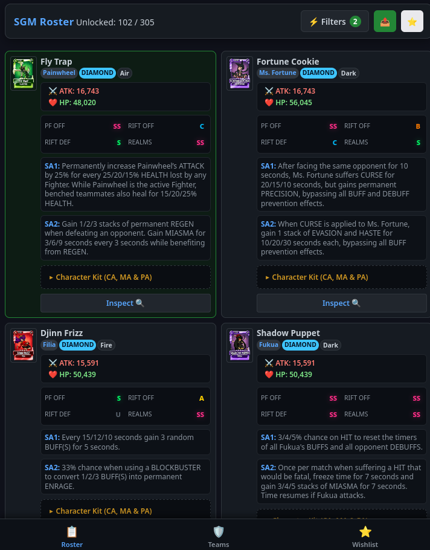

# Skullgirls Mobile - Roster & Ability Tracker (v2.0.0 - Mobile PWA Edition)

An advanced offline-first web application and Progressive Web App (PWA) designed for Skullgirls Mobile players to track their variant collection, build custom teams with live synergy analysis, manage wishlists, inspect fighter kits and official Fandom Wiki loadouts, filter by combat modifiers, and export custom rosters.


---

## 🌟 Live Demo & Mobile PWA Installation

📱 **Play Online / Install on Smartphone (No PC Required):**
👉 **[https://mattex111.github.io/sgm-roster-tracker/](https://mattex111.github.io/sgm-roster-tracker/)**

### 📱 Installing to Home Screen (iOS & Android)
- **Android (Chrome / Edge / Firefox):** Open the link ➔ Tap **⋮** (top right) ➔ Tap **"Add to Home screen"**.
- **iOS (Safari):** Open the link ➔ Tap **Share** (square with up arrow) ➔ Tap **"Add to Home Screen"**.

---

## What's New in v2.0.0

- 📱 **100% Standalone Mobile PWA (Progressive Web App):** Runs directly on smartphones with **zero PC or Python backend required**.
- ⚡ **Offline Cache Service Worker (`sw.js`):** Pre-caches app layout, styles, scripts, and variant datasets for instant loading even offline or in airplane mode.
- 💾 **1-Click Backup & Restore (`sgm_tracker_backup.json`):** Download and import single `.json` backup files to transfer or restore your unlocked roster, relic wishlist, and custom teams between PC and phone in 1 second.
- 🔄 **One-Tap Filter Reset Button:** Instantly clear search text, character/tier/modifier checkboxes, element, status, mode, and tier rank dropdowns with one click (`🔄 Reset Filters`).
- ⬅️ **Inspector Navigation Stack (`← Back`):** Jump between fighter team chips inside the Inspector Modal and navigate backwards smoothly with a dynamic back button.
- 🔗 **Reverse Team Synergy Search ("Featured In Teams"):** Scans all recommended teams across the database to display team compositions where the inspected character is cited as a synergy partner (e.g. *Red Velvet* in *Angel Maker*'s recommended team).
- 🚀 **Automated GitHub Actions CI/CD:** Auto-compiles and deploys static PWA bundle to GitHub Pages on every `git push`.

---

## Features

- **Interactive Roster Checklist:** Tap anywhere on a fighter card to mark it as owned with local storage persistence (`localStorage` & `my_roster.json`).
- **Team Builder & Synergy Analyzer:** Create, save, and manage custom 3-fighter loadouts tailored for specific game modes (*Prize Fight*, *Rift Offense*, *Rift Defense*, *Parallel Realms*). Previews combined Signature Abilities (SA1 & SA2) and support synergies.
- **Wishlist Tracker:** Track target Gold and Diamond variants with interactive priority slots.
- **Base Stats (Max Lvl 60):** Official Max ATK and HP stats for all 305+ variants.
- **Full Character Kit:** Expandable details showing Character Ability (CA), Prestige Abilities (PA), and Marquee options (MA).
- **Official Wiki Loadouts:** Integrated Stat Investments, Role & Strategy, Rift notes, and Multi-Setup Movesets scraped directly from the official Skullgirls Mobile Fandom Wiki.
- **Global Text & Modifier Multi-Search:** Filter fighters by specific Buffs and Debuffs (e.g. *Hex*, *Curse*, *Armor*, *Thorns*) with keyword highlighting.
- **Meta Tier Ratings:** Community tier ratings across 4 modes (PF Offense, Rift Offense, Rift Defense, Parallel Realms) sourced from the [Fandom Community Tier List](https://skullgirlsmobile.fandom.com/wiki/Tier_List).
- **Custom Clipboard Exporter:** Export selections in Full markdown, single-line Compact summaries, or comma-separated name lists.
- **Accident Prevention:** Bulk selection safeguards with one-click Undo (`Ctrl+Z`).
- **100% Offline & Private:** No accounts, external servers, or tracking cookies.

---

## Screenshots

     

---

## Local Setup & Run (Desktop Development)

### Prerequisites
1. **Python (3.8 or higher):** Download from [python.org](https://www.python.org/downloads/).
2. **Git:** Download from [git-scm.com](https://git-scm.com/downloads).

### Installation

```bash
git clone https://github.com/Mattex111/sgm-roster-tracker.git
cd sgm-roster-tracker
python3 -m venv venv
source venv/bin/activate  # On Windows: venv\Scripts\activate
pip install -r requirements.txt
python3 app.py
```
Open [http://localhost:5000](http://localhost:5000) in your browser.

---

## License

Distributed under the MIT License. See `LICENSE` for details.
